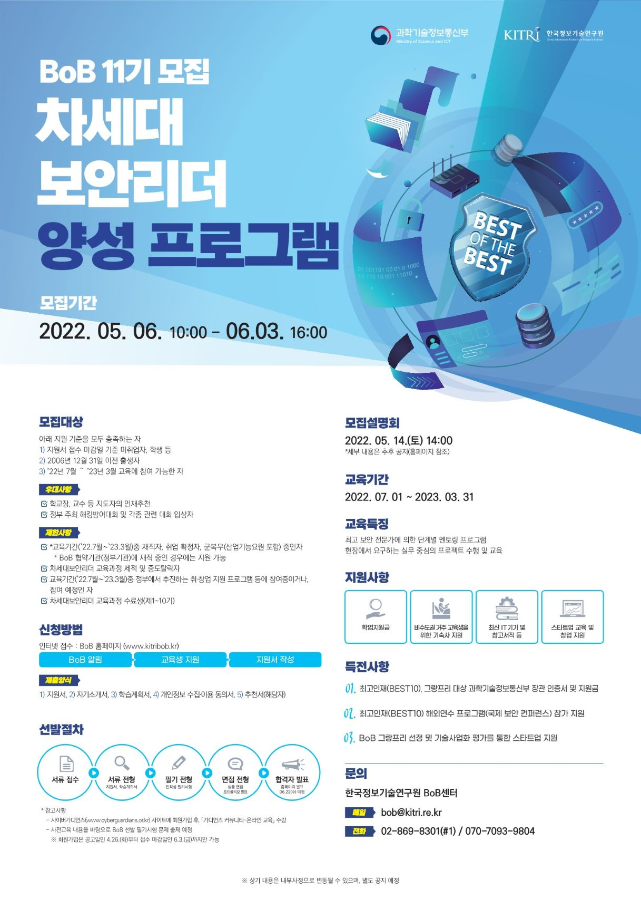

지난 22년 6월 22일 17시에 BOB 11기 최종 합격자가 발표났습니다.
지난 7기 도전에 실패하고 이후 군 전역 후 11기에 지원하게 됐는데 합격한 후기를 남겨볼까 합니다. 일단 10기와 달라진 점은 기존 4가지 취약점분석, 디지털포렌식, 보안컨설팅, 보안개발 트랙을 각각 선발했는데, 이번 11기는 통합 선발 후 내부 교육평가를 통해서 트랙을 선발한다고 합니다.

우선 BOB 공식 페이지의 11기 모집요강입니다.

[https://www.kitribob.kr/board/detail/1/6943?current_page=1&per_page=15](https://www.kitribob.kr/board/detail/1/6943?current_page=1&per_page=15)

BOB는 1단계 서류평가 이후 2배수 합격자 대상으로 인적성 검사, 필기평가, 면접평가를 진행하게 됩니다. 1단계 서류평가에서는 다음과 같은 항목을 평가합니다.

- 자기소개서
- 추천서(선택)
- 포트폴리오(선택)
- 활동 프로젝트 내역
- 자격증 취득내역

저는 기본적인 자기소개서와 학과장님의 추천서, 제가 활동한 프로젝트 내역으로 만든 포트폴리오를 만들어 제출했고 정보처리산업기사 자격증도 기입했습니다. BOB에 지원하실 분이라면 추천서는 친분이 있는 교수님을 찾아뵈어 꼭 받으시길 바라며, 개발이나 보안관련으로 진행한 프로젝트가 있으면 이 또한 포트폴리오로 만들어 제출하심이 좋겠습니다.

전 자기소개서를 작성할때 제가 프로젝트를 하면서 어떤걸 공부했는지, 또 어떤점에 흥미를 느껴 어떤 분야로 진출하고 싶은지를 적었습니다. 또 활동 내역에서 학과에서 진행한 ISMS 프로젝트, 개발 프로젝트 그리고 정보보호병 활동에서 어떤걸 분석했고 보안장비로 관제를 진행한 내용을 바탕으로 작성했습니다. 

이런 활동을 중점에 둔다기 보다는 이런 활동으로 앞으로 더 발전할 수 있는 사람이라는걸 보여주는 방향에 중점을 두었고 분대장을 하면서 다른 사람들간의 화합도 같이 작성했습니다.

다른 분들 말씀을 좀 들어보니 1000자씩 7개 항목을 꽉 채워서 적기보다는 내가 활동하면서 어떤점을 느끼고 어떤 방향으로 나아가고 싶은지 진솔하게 적는게 중요한것 같았습니다.

<h3 style="color:red">모두 아시겠지만 자기가 직접 참여하고 공부한 내용을 적어야 합니다. 안그러면 1차에 합격해도 2차 면접에서 영혼까지 털릴겁니다. </h3>

전 자기소개서를 작성하면서 면접 준비를 동시에 진행하는걸 추천드립니다. 결국 면접의 질문은 자기소개서와 포트폴리오, 자기가 활동한 프로젝트 위주로 나오기 때문이죠.

  

이렇게 1차 서류에 합격하셨다면 2대1 경쟁률만 뚫으시면 BOB에 합격할 수 있습니다.

서류에 합격하면 면접을 보기에 앞서서 인적성 검사와 필기시험을 응시해야 합니다. 인적성 검사는 말 그대로 직업의 적합도, 사람의 성향을 수치적으로 판단하기 위해서 하는것 같습니다. 필기시험은 개인적인 생각으로 정보보안기사보다 조금 더 쉽게 나온것 같습니다. 다만 제가 포렌식 쪽 공부를 거의 안하다 보니 포렌식 분야의 문제는 조금 어려웠습니다. 50분 시험시간에 100문제가 나오다 보니, 난이도가 그리 높게 나오진 않은것 같습니다.

우선 1차 합격하고 필기 공부는 가볍에 아는 내용을 다시 상기시키는 정도로 하고 면접에 집중하는 방향으로 진행했습니다.

면접 내용은 정확하게 말씀 드리기 어려우나, 압박면접 + 꼬리질문이 많았습니다. 면접관 3명, 지원자 3명으로 30분동안 면접을 진행했습니다. 3분정도의 자기소개를 진행하고 제가 자기소개서에서 작성한 내용을 바탕으로 질문을 해주셨습니다. 면접을 준비하실때 어떤 분야나 예상 질문에 대해서 3개 정도의 꼬리질문을 예상하고 준비한게 많은 도움이 되었습니다.

- ~라는걸 하고 싶다고 했는데 정확하게 어떤걸 하고싶은지?
- 그럼 그 분야에 대해 어떤 부분을 하고 싶은지?
- 이런 기법을 공부했다고 했는데 이를 막을수 있는 방법과 그 방법을 우회할 방법은?
- 이러이러한 것을 진행했다고 하는데 그 걸 진행하면서 이런 지식도 필요한데 ~가 무엇인지?

위 같은 유형의 느낌이라고 보시면 될것 같습니다. 

모르는 부분은 솔직하게 모른다고 대답하고 꼭 학습하고 싶다는 의지를 보여주는 것도 중요한것 같습니다. 

그리고 생각보다 면접시간이 짧아서 핵심만 간결하고 정확하게 말하는 것도 중요한것 같습니다.
위에 적은것 처럼, 면접 질문이 자기소개서를 기반으로 나오기 때문에 자기소개서에 기술한 내용은 전부 숙지 하셔야 하고 그 자기소개서를 기반으로 예상할수 있는 모든 꼬리 질문의 꼬리 질문까지 알아두시면 좋을 것 같습니다.

면접에서 가장 중요한건 자신이 준비한 내용을 면접관이 질문하게 끔 유도하는 것이 포인트라고 생각합니다.

 

이렇게 준비해서 면접을 봤는데 솔직히 기대를 안했습니다. 긴장을 너무 많이해서 잠을 아에 못자고 면접을 보기위해 대전에서 서울까지 갔고, 면접을 보면서 너무 떨어서 말을 더듬었기 때문입니다. BOB에서 뽑히는 유형은 보통 매우 특출나게 잘하거나, 교육을 받았을때 기대할 수 있는 결과와 성과가 좋은 느낌을 주었는지 인것 같습니다.

휴학하고 알바하면서 3달 가량 준비한 것 같습니다. 글을 쓰는 지금 BOB 워크샵을 다녀왔습니다. 다른 분들도 이후 12기를 지원하셨을 때 이 글이 많은 도움이 되었으면 좋겠네요.

1차 기본 교육과 심화교육의 강도가 매우 빡세다는데 벌써 무섭습니다. 그래도 최대한 몸이 버틸수 있을때 까지 해봐야겠네요.

이 사진은 면접 대기하면서 BOB센터에서 찍은 사진...

교육 진행하고 프로젝트 하면서 센터에서 노숙하는 사람도 많다는데 무섭기도 하고 기대도 되네요.